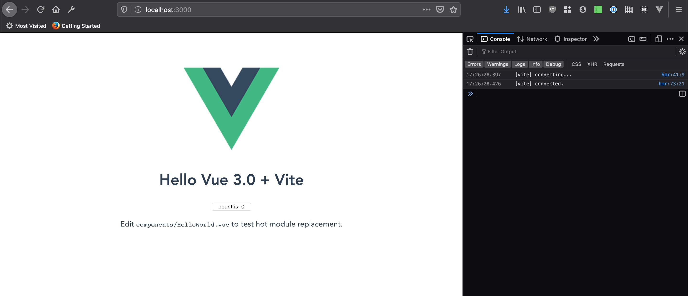
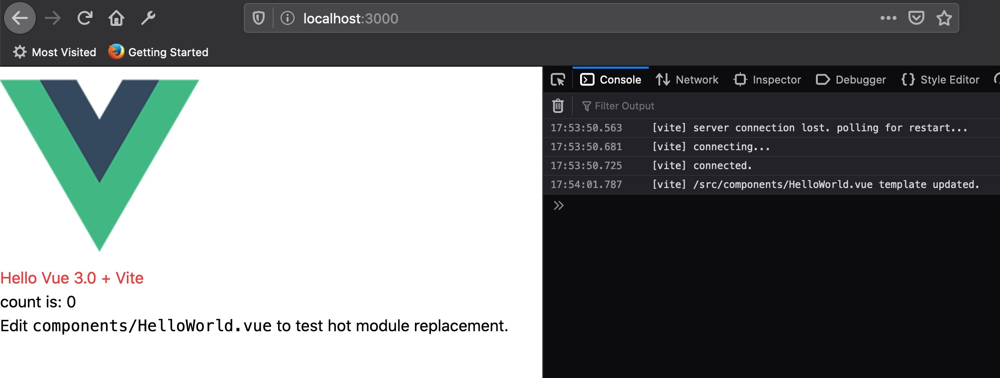

You can find all the files for this [on github](https://github.com/murilobd/vue-phaser-spritesheet)

## TypeScript

I sticked to my plan using Vue 3 + TypeScript. Before digging into Vue 3, I went to [TypeScript](https://www.typescriptlang.org/) website and found a very handful [TypeScript in 5 minutes handbook](https://www.typescriptlang.org/docs/handbook/typescript-in-5-minutes.html) that I read and coded it. I was already familiarized with all concepts introduced on that guide, but it was a super good refresh to my mind! It's absolutely awesome to have a type-checker in the IDE to help you to avoid code mistakes.


## Vite + Vue 3

Basics of TypeScript refreshed, let's move to Vue 3 now. [Evan You](https://twitter.com/youyuxi) (creator of VueJS) a while ago started tweeting a lot about [Vite](https://github.com/vitejs/vite) and saying just how fast it was to serve and build an application. So, why not try it? I created my first Vite project (that uses Vue 3) by simply running:

```
yarn create vite-app phaser-spritesheet
cd phaser-spritesheet
yarn
yarn dev
```

and boom! Accessing https://localhost:3000



As it's said on [Vite documentation](https://github.com/vitejs/vite#typescript), it supports TypeScript out of the box. So, let's just do a simple test and make sure it works:

1. rename `src/main.js` to `src/main.ts`
2. on `index.html`, change line 13 to import `main.ts` instead of `main.js`

Ta-dam! Works like magic!

## TailwindCSS

Let's add [TailwindCSS](https://tailwindcss.com/docs/installation) now to the project as it's going to be our CSS framework. Let's stick to documentation and see how it goes:

1. yarn add tailwindcss
2. change `src/index.css` and fill it with all 3 necessary imports
3. run `npx tailwindcss init`
4. create `postcss.config.js` file in root (and as said in [vite documentation](https://github.com/vitejs/vite#postcss), Vite automatically applies PostCSS configuration)

Those 4 steps are what the [vite-tailwind-starter repo](https://github.com/posva/vite-tailwind-starter) has. It's worth check it out.

It should work, hehe! Let's try a really simple example and add a _text-red-500_ class to `<h1>` in `components/HelloWorld.vue`

```html
<h1 class="text-red-600">{{ msg }}</h1>
```



Nice! All good!! Final step now is to add [Tailwind UI](https://tailwindui.com/) and create a pretty simple layout

## Next step

I have the layout ready to go! Next step now is to understand how to plug phaser to the project and, in runtime, execute it and display a simple [spritesheet](<https://en.wikipedia.org/wiki/Sprite_(computer_graphics)>) being animated. This will be on post Game Creator #3.
