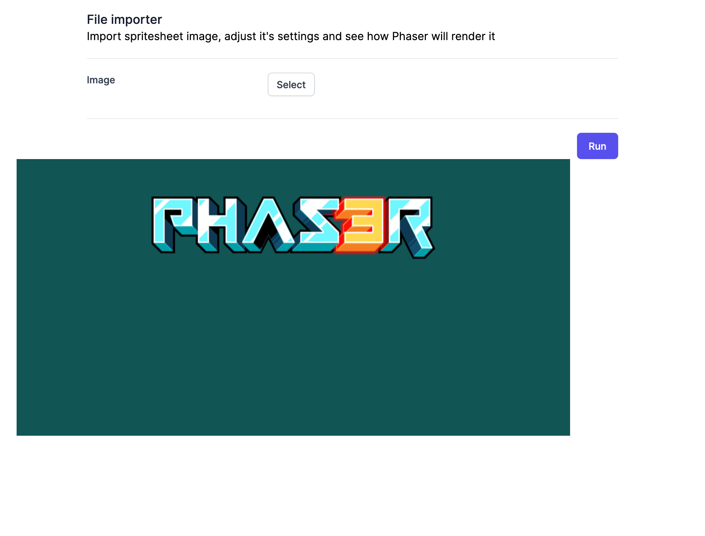

To integrate phaser to Vue, first I googled to see who had done it and how. And, I came across this [repository](https://github.com/Sun0fABeach/vue-phaser3). I confess that I didn’t forked it and tested it, but looking at the code, it looks alright! Also, I’m going to use the same approach as [SunOfABeach](https://github.com/Sun0fABeach) did: create a function that will export Phaser.game.

But, before, I’ll navigate through [Phaser documentation](https://photonstorm.github.io/phaser3-docs/) just to give a glimpse of how to create a really simple example! By doing that, I saw [how to use typescript](https://github.com/photonstorm/phaser/tree/master/types) and also an [example they created using typescript](https://github.com/photonstorm/phaser3-typescript-project-template/blob/master/src/game.ts). Let’s mix now both approaches!

So, first part is: let’s try to render a very simple scene with an image. To load images, we have to **pre-load** it insider a _preload()_ function. After that, inside _create()_, we add the preloaded image into the scene (and as an extra, we can add an animation to it!)

```js
// demo.ts
import "phaser";
import logo from "../assets/phaser3-logo.png";

export default class Demo extends Phaser.Scene {
	constructor() {
		super("demo"); // name of the scene
	}

	preload() {
		this.load.image("logo", logo);
	}

	create() {
		const logo = this.add.image(400, 70, "logo");
		this.tweens.add({
			// animate logo to go up/down
			targets: logo,
			y: 350,
			duration: 1500,
			ease: "Sine.inOut",
			yoyo: true,
			repeat: -1,
		});
	}
}
```

Now, let’s create our main game file that will initialize Phaser with the scene included

```js
// game.ts
import "phaser";
import Demo from "./demo";

export default function game(
	containerId: string = "gameContainer"
): Phaser.Game {
	return new Phaser.Game({
		type: Phaser.AUTO,
		backgroundColor: "#125555",
		width: 800,
		height: 400,
		parent: containerId,
		scene: Demo,
	});
}
```

notice that if containerId is not informed, it will automatically uses “gameContainer”.

I could simply import this directly into the App.vue file, but I’ll create a specific component just for that: Game.vue.

```vue
<template>
	<div id="gameContainer"></div>
</template>

<script lang="ts">
import Game from "../game/game";

import { onMounted, defineComponent } from "vue";

export default defineComponent({
	name: "Game",
	setup() {
		onMounted(() => {
			Game("gameContainer");
		});
	},
});
</script>
```

It’s a basic component that imports game.ts and, when mounted, it will call _game(‘gameContainer’)_ to launch Phaser.

Okey dokey… now, as simple as that, we import Game.vue component into our App.vue and voilá!

```vue
<template>
	<div class="max-w-7xl mx-auto px-4 sm:px-6 lg:px-8">
		<div class="max-w-3xl mx-auto">
			<FileImporter />
		</div>
	</div>
	<div class="max-w-7xl mx-auto px-4 sm:px-6 lg:px-8">
		<Game />
	</div>
</template>

<script>
import FileImporter from "./components/FileImporter.vue";
import Game from "./components/Game.vue";
import { defineComponent } from "vue";

export default defineComponent({
	name: "App",
	components: {
		FileImporter,
		Game,
	},
});
</script>
```



Cool! Very cool!!! Next step: figure it out how to load user’s image into Phaser!
