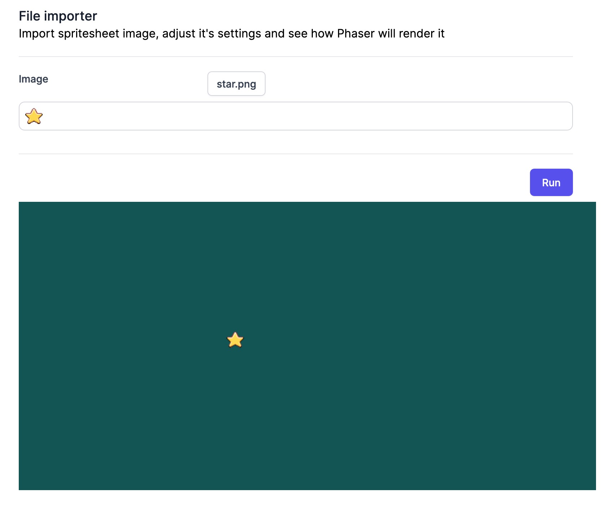

This will be a tutorial post: how to do something step-by-step to achieve a goal. The goal, in this case, is to display the selected user's image in Phaser.

To be able to achieve this goal, I used 3 references (a special thanks to first one):
- [https://supernapie.com/blog/loading-assets-as-data-uri-in-phaser-3/](https://supernapie.com/blog/loading-assets-as-data-uri-in-phaser-3/)
- [https://github.com/Quinten/phaser-3-assets-as-data-uri/blob/master/src/index.js](https://github.com/Quinten/phaser-3-assets-as-data-uri/blob/master/src/index.js)
- [https://github.com/photonstorm/phaser3-examples/blob/master/public/src/textures/sprite%20sheet.js](https://github.com/photonstorm/phaser3-examples/blob/master/public/src/textures/sprite%20sheet.js)


So, let's do it. On posts [#3](https://murilobd.com/game-creator/3-loading-file-in-vue-3/) and [#4](https://murilobd.com/game-creator/4-integrating-phaser-into-vue-3/), we had created a structure that will allow user to select an image file and loading and displaying Phaser in the browser. Now, we will take that image and pass to Phaser to render it.

Let's first create our Scene that will accept and image string (base64 encoded):

```js
import "phaser";

export default class SpritesheetPreview extends Phaser.Scene {
	public _img: string;

	constructor(img: string) {
		super("spritesheet-preview"); // name of the scene
		this._img = img;
	}
}
```

No comes the tricky part! In a nutshell, from what I've understood, what happens is:
1. we load the image into [Texture Manager](https://photonstorm.github.io/phaser3-docs/Phaser.Textures.TextureManager.html)
   ```js
   this.textures.addBase64("userImage", this._img);
   ```
2. then, we use [Image API](https://developer.mozilla.org/en-US/docs/Web/API/HTMLImageElement/Image) to load the image into browser (and, somehow, Phaser Texture Manager uses this image too). When browser has loaded that image, we can display it
   ```js
   var shardsImg = new Image();
	shardsImg.onload = () => {
		// image loaded
	};
	shardsImg.src = this._img;
	```
3. add image to Phaser scene
   ```js
   this.add.image(300, 50, "userImage");
   ```

I've tried a lot of different approaches but this was the one which worked. Here's the final code

```js
import "phaser";

export default class SpritesheetPreview extends Phaser.Scene {
	public _img: string;

	constructor(img: string) {
		super("spritesheet-preview"); // name of the scene
		this._img = img;
	}

	create() {
		this.textures.addBase64("userImage", this._img);
		var shardsImg = new Image();
		shardsImg.onload = () => {
			this.imageLoaded();
		};
		shardsImg.src = this._img;
	}

	imageLoaded() {
		const userImage = this.add.image(300, 50, "userImage");
		this.tweens.add({
			targets: userImage,
			y: 350,
			duration: 1500,
			ease: "Sine.inOut",
			yoyo: true,
			repeat: -1,
		});
	}
}
```

Now we need the main phaser configuration that will load this scene AND accept as parameter an image string (to pass down to Spritesheet Scene)

```js
import "phaser";
import SpritesheetPreview from "./spritesheet-preview";

export default function game(
	containerId: string = "gameContainer",
	img: string,
): Phaser.Game {
	return new Phaser.Game({
		type: Phaser.AUTO,
		backgroundColor: "#125555",
		width: 800,
		height: 400,
		parent: containerId,
		scene: new SpritesheetPreview(img),
	});
}
```

From FileImporter component, we will emit the loaded image string and then we will create a prop inside Game component that will accept this image string and pass it to the SpritesheetPreview component. The whole functional code for this is at [initial-image-preview branch](https://github.com/murilobd/vue-phaser-spritesheet/tree/initial-image-preview)

